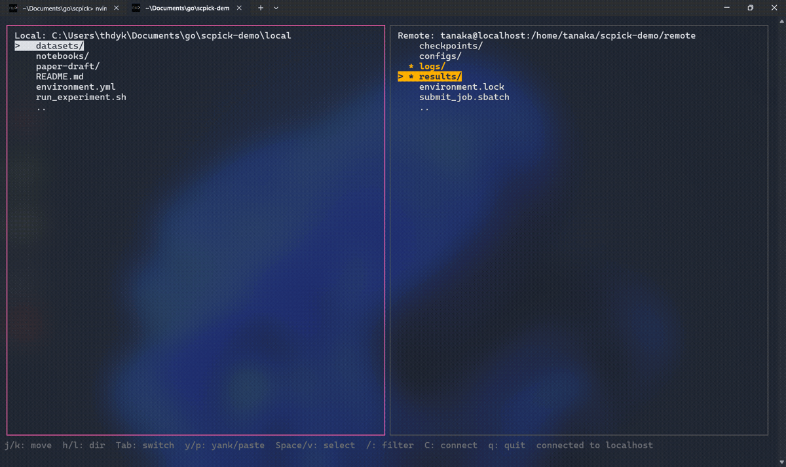

# scpick

[](https://github.com/Namacha411/scpick/actions/workflows/ci.yml)
[](https://github.com/Namacha411/scpick/releases)
[](go.mod)
[](LICENSE)

An interactive SCP/SFTP file transfer tool that runs as a single static
binary on both native Windows (PowerShell, no WSL/Git Bash) and Linux, with
no dependency on external `ssh`/`scp`/`fzf` binaries.

Running `scpick` opens a dual-pane file manager — local on the left, remote
on the right — with vim-style keys. Pick a file in one pane, yank it (`y`),
move to the other pane, and paste (`p`). Direction (upload vs. download)
follows whichever pane you yanked from; there's no separate "pull"/"push"
command to remember.



## Install

**Download a prebuilt binary** from the
[Releases page](https://github.com/Namacha411/scpick/releases) (Windows and
Linux, amd64) and put it on your `PATH`.

**Or build from source** (requires Go 1.26.5+):

```sh
git clone https://github.com/Namacha411/scpick.git
cd scpick
go build -o bin/scpick ./cmd/scpick
```

`go install ./cmd/scpick` works too, and puts the binary in `$(go env GOPATH)/bin`
instead of `./bin` — handy if that directory is already on your `PATH`.

Cross-compile for either platform (always `CGO_ENABLED=0` — the binary must
stay dependency-free):

```sh
GOOS=windows GOARCH=amd64 CGO_ENABLED=0 go build -o bin/scpick.exe ./cmd/scpick
GOOS=linux   GOARCH=amd64 CGO_ENABLED=0 go build -o bin/scpick     ./cmd/scpick
```

## Usage

```sh
scpick
```

There are no subcommands — everything happens inside the TUI. Two flags exist
outside of it: `scpick --version` prints the build's commit and build time
(there's no meaningful semver tag to show), and `scpick --help` prints this
usage summary.

### Connecting

`scpick` opens straight into a host picker: every `Host` entry in
`~/.ssh/config`, plus a manual-entry option (hostname/user/port) for
anything not in your config. Press `Esc` to skip this and go straight to
browsing the local pane instead; press `C` any time later to (re)connect —
this always replaces the current remote connection, since only one is held
at a time.

Authentication is tried in order: ssh-agent (Unix socket, or the Windows
OpenSSH named pipe), then `~/.ssh/id_ed25519`/`id_rsa`/`id_ecdsa`, then an
interactive masked password prompt. The host key is checked against
`~/.ssh/known_hosts`: an unknown host shows its fingerprint and asks whether
to trust it, while a key that doesn't match a known entry always aborts the
connection with no prompt. Once connected, the remote pane opens at the
login user's home directory.

### Browsing and transferring

| Key(s) | Action |
| --- | --- |
| `j` / `k` | move the cursor down / up |
| `h`, `-`, `Backspace` | go to the parent directory |
| `l`, `Enter` | open the directory under the cursor |
| `Tab` | switch focus between the two panes |
| `Space` | toggle a mark on the entry under the cursor |
| `v` | visual mode: extend a mark range as you move `j`/`k` |
| `y` | yank the marked entries (or just the one under the cursor) |
| `p` | paste the yank into the *other* pane — starts a transfer |
| `/` | incremental fuzzy filter by name |
| `C` | connect, or reconnect, the remote pane |
| `?` | show the full keybinding help screen |
| `q` | quit |

Yanking a directory always transfers it recursively. Pasting (`p`) asks
once, for the whole paste, whether to overwrite (`o`) or skip (`s`) any
destination files that already exist — or `Esc` to cancel — then shows a
progress bar. One failed file doesn't abort the rest of the batch; a
summary (succeeded/skipped/failed) is shown when it's done.

## Why

If you manage several SSH servers and move files around often, the usual
tools each cost you something:

- Plain `scp`/`sftp` means retyping host, user, and full paths every time,
  with no listing of what's actually in the remote directory first.
- On Windows, `scp`/`fzf`-based workflows mean installing and maintaining
  WSL or Git Bash just to get a Unix-like toolchain, instead of working
  natively in PowerShell.
- GUI clients (WinSCP, FileZilla, ...) drop you into mouse-driven,
  non-vim keybindings, and usually can't be scripted or driven headlessly.

`scpick` is a single static binary — no `ssh`/`scp`/`fzf` dependency, no
cgo — that gives you the same dual-pane, vim-keyed browsing experience on
both Windows and Linux, with `~/.ssh/config` doing the host bookkeeping for
you. (An earlier version was built on
[`go-fuzzyfinder`](https://github.com/ktr0731/go-fuzzyfinder); it was
replaced with a custom `bubbletea`/`lipgloss` TUI once fixed, non-remappable
keybindings turned out to be a hard limit — see `SPEC.md` for the full
history.)

## Development

See `SPEC.md` for the full design spec and `CLAUDE.md` for architecture
notes and common commands (build, test, lint). Contributions are welcome —
see `CONTRIBUTING.md` to get started.

## License

MIT — see `LICENSE`.
